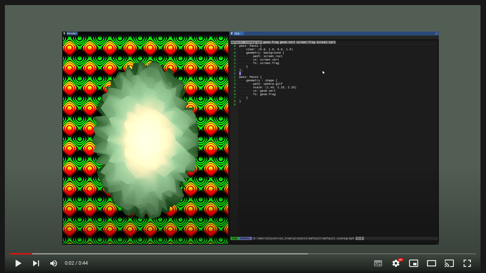

[VkLive](https://github.com/cmaughan/vklive) - A Vulkan Live Coding Editor
===================================================================================================
[](https://github.com/cmaughan/vklive/actions/workflows/builds.yml)
[](https://github.com/cmaughan/vklive/blob/master/LICENSE) 

This is a *work in progress* Vulkan/Shader editing project.  It runs on Windows and has recently been fixed to run on Mac.  Linux shouldn't be much of a stretch at this point.

Currently, you can edit a simple description of your scene in terms of passes and geometry, then you can edit the shader files in your project folder.  The main selling point is the easy UI, and great error feedback when editing shaders.
I've written live coding tools before, but not published anything for a while.  This is thrown together from previous attempts, with the hope of building something simpler that is useful without over-complicating it.
Mostly the code is c-like, with structs and functions.  It should be relatively easy to follow.  The ImGui bits are ported to Vulkan hpp, which might be useful to some; it is certainly more manageable this way.

If you like live coding, shaders, shadertoy, or are learning how to use Vulkan to render, then this might be a fun tool for you to play with.  If you make a nice project, please send it along, or add a screenshot to the screenshot thread!
Built for fun, and to update my GPU graphics knowledge.

## Features
- CTRL+ENTER to evaluate the project/shader you are viewing.
- Can edit/save the files in modal VIM or Notepad style mode (CTRL+2 or CTRL+1).
- Scene description for passes and geometry
- Fragment, Vertex and Geometry Shaders have been tested so far.
- Load/Save projects in different folders
- All API objects are debug-labelled, including the ImGui ones, making it easy to diagnose errors in tools like NVIDIA Nsight, and find your way around.
- Default project has background and foreground geometry and time input.

## TODO
- Texture support (yes, not there yet, so no reading pass targets.  next on the list...)
- More error checking of device creation problems.
- More flexible UBO.  You can't change the UBO yet (eventually you will get an automatically built UBO based on your spec)
- Ray tracing support.
- Audio input to an audio spectrum texture, for live coding to music.
- Low DPI/Mac DPI.  You may not have a good experience on a low DPI setup, and on Mac there are tweaks required too.

## Video Overview
[](https://www.youtube.com/watch?v=SCLOAnh7eX0 "VkLive Demo")

Built on the Zep editor: https://github.com/Rezonality/Zep

## Build
Don't forget to pull the submodules (vcpkg for all the libraries I use, Zep for the editor).
On Mac I build it with CLion.  On Windows, I usually load the solution into Visual Studio after the config step.

```
git submodule update --init
prebuild.bat OR ./prebuild.sh
config.bat OR ./config.sh
build.bat OR 'cmake --build .' in the build folder
```

