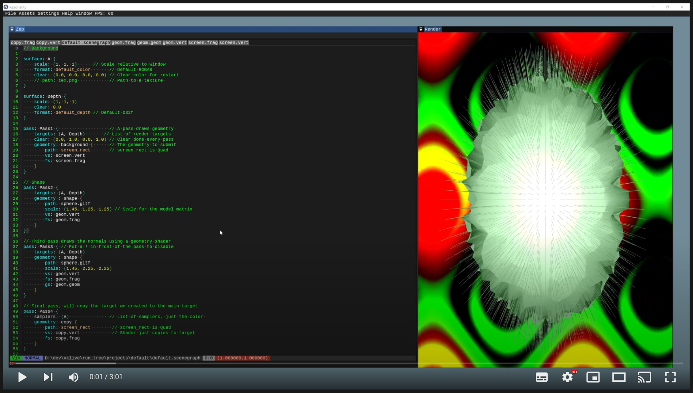

[VkLive](https://github.com/cmaughan/vklive) - A Vulkan Live Coding Editor
===================================================================================================
[](https://github.com/cmaughan/vklive/actions/workflows/builds.yml)
[](https://github.com/cmaughan/vklive/blob/master/LICENSE) 

This is a *work in progress* Vulkan/Shader editing project.  It runs on Windows and has recently been fixed to run on Mac.  Linux now builds but hasn't been tested yet!
I've been building live editing tools for years, but they always got too big and I never got to the point of shipping anything.  This project pulls in the best/working bits of the visual tools I've built and ships it ;)  I've paid attention to managing the basics, and making things work well. I'd love to know what you think.

Currently, you can edit a simple description of your scene in terms of passes and geometry, then you can edit the shader files in your project folder.  The main selling point is the easy UI, and great error feedback when editing shaders.
Mostly the code is c-like, with structs and functions.  It should be relatively easy to follow.  The ImGui bits are ported to Vulkan hpp, which might be useful to some; it is certainly more manageable this way.

If you like live coding, shaders, shadertoy, or are learning how to use Vulkan to render, then this might be a fun tool for you to play with.  If you make a nice project, please send it along, or add a screenshot to the screenshot thread!
Built for fun, and to update my GPU graphics knowledge.

## Video Overview
[](https://youtu.be/mebNIQt8pKE "VkLive Demo")

## Features
- CTRL+ENTER to evaluate the project/shader you are viewing.
- Can edit/save the files in modal VIM or Notepad style mode (CTRL+2 or CTRL+1).
- Scene description for passes and geometry
- Fragment, Vertex and Geometry Shaders have been tested so far.
- Load/Save projects in different folders
- All API objects are debug-labelled, including the ImGui ones, making it easy to diagnose errors in tools like NVIDIA Nsight, and find your way around.
- Default project has background and foreground geometry and time input.

## TODO
- Texture support (yes, not there yet, so no reading pass targets.  next on the list...)
- More error checking of device creation problems.
- More flexible UBO.  You can't change the UBO yet (eventually you will get an automatically built UBO based on your spec)
- Ray tracing support.
- Audio input to an audio spectrum texture, for live coding to music.
- Low DPI/Mac DPI.  You may not have a good experience on a low DPI setup, and on Mac there are tweaks required too.

## Build
Don't forget to pull the submodules (vcpkg for all the libraries I use, Zep for the editor).
On Mac I build it with CLion.  On Windows, I usually load the solution into Visual Studio after the config step.
You will likely need to install the latest Vulkan SDK on your platform (and at time of writing, you definately need the latest)

```
git submodule update --init
prebuild.bat OR ./prebuild.sh
config.bat OR ./config.sh
build.bat OR 'cmake --build .' in the build folder
```

## Design
So how does it work? Firstly, all text editing is handled by Zep.  It does the heavy lifting of showing tabs, editing text, flashing when you evaluate, syntax coloring, error popups, etc.
The windows are created by SDL, and the UI is drawn by ImGui. The rendering engine is designed as a simple collection of C-like functions and structs.  There is a thread in the main application which can spot changes to the code, rebuild the vulkan pipeline and send the new state into an update queue if it works.  If it doesn't, the previous state is maintained until it is fixed.  The Vulkan validation layers catch all problems so far, which helps keep the app stable while the user tweaks things.
The scenegraph is a simple language parsed by MPC, and controls the render passes.
I'll write more here when I get time ;)

## Built On
Built on the Zep editor, the project I built that started this journey several years ago: https://github.com/Rezonality/Zep

Vulkan - The project currently uses Vulkan for all rendering.  I may do Metal/DX12 at some point for fun.

VCPKG - Microsoft's freaking awesome cross platform manager with an unfortunate 'not sounding cross platform at all' name.  The following packages are used currently:
Freetype - Better font rendering
assimp - Asset import for loading models
clipp - Commandline parser for command line arguments
fmt - String formatting library
imgui - ImGui API
reproc++ - Process launch library for loading shader compiler binary
SDL2 - SDL UI library for creating windows, etc.
tomlplusplus - Toml file format parser for reading config files
unofficial-concurrentqueue - Concurrent lock/free queue for thread interactions
tinyfiledialogs - File dialogs that look OS specific and more standard
unofficial-nativefiledialog - File dialogs that look OS specific and more standard
mpc - The parser used in the scene graph file

